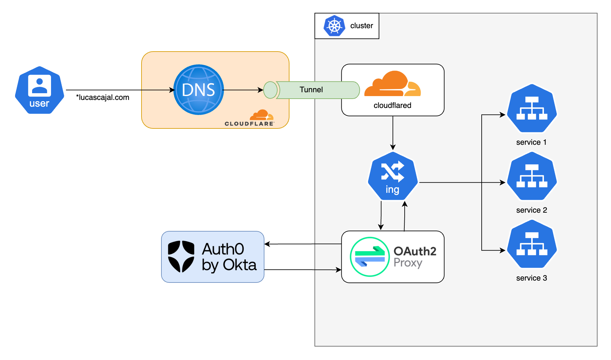

# Kubernetes playground and examples
This repository serves as my personal kubernetes learning journal. It contains examples and tests for testing & playing with kuberentes, using kind. It evolves as new concepts are learned and tested.

The final picture should end up looking similar to the [🚀 ArgoCD Self-Managed Example](https://github.com/imjoseangel/k8s-gitops) repository, which is a core reference for this learning journey, and [it's maintainer](https://github.com/imjoseangel) a k8s mentor of mine. Big kudos to him.

## Usage
### Requirements
Install these CLI tools:
- [kind](https://kind.sigs.k8s.io/docs/user/quick-start)
- [kubectl](https://kubernetes.io/docs/tasks/tools/#kubectl)
- [Helm](https://helm.sh/docs/intro/install/)
- cloudflared - following https://developers.cloudflare.com/cloudflare-one/tutorials/many-cfd-one-tunnel/

Register in an OIDC provider (we used Auth0) and register an app. Copy the [oidc-secret-example.env](oauth2-proxy/oidc-secret-example.env) file as `oidc-secret.env` in the same directory, put your app's `CLIENT_ID` and `CLIENT_SECRET` in it, and generate the value for `COOKIE_SECRET` with
```bash
dd if=/dev/urandom bs=32 count=1 2>/dev/null | base64 | tr -d -- '\n' | tr -- '+/' '-_' ; echo
```
To also use Auth0 for the ArgoCD UI, copy the the file [`argocd-cm-example.yaml`](./argocd/patches/argocd-cm-example.yaml) to a new file `argocd-cm.yaml` in the same directory and populate it with your Auth0 app's values.

Finally, create a Cloudflare account and register a domain. Log in to cloudflare by executing the command below and following the instructions:
```bash
sudo cloudflared tunnel login
```
> The `cloudflared` tunnel is an easy and secure way to expose your cluster to the internet without having to configure your home router and open ports.
### Cluster creation
```bash
sudo make cluster
```
>If the command fails, with a message saying `The kubelet is unhealthy due to a misconfiguration of the node in some way (required cgroups disabled)`, run
>```bash
>sudo nano /boot/firmware/cmdline.txt
>```
>and add these options at the start of the line:
>```bash
>cgroup_enable=memory cgroup_memory=1
>```
>Then, reboot your system with `sudo reboot`. [Read more details](https://ubuntu.com/tutorials/how-to-kubernetes-cluster-on-raspberry-pi#4-installing-microk8s) on this.


This will:
- Create a kind cluster
- Set up NGINX ingress controller
- Create `dev`, `uat` and `prod` namespaces
- Set up tunnel:
    - Create a Cloudflared tunnel
    - Add DNS records to cloudflare pointing to the tunnel
    - Create cloudflared image deployment
    - Foward all traffic from tunnel to the ingress controller
- Create [OAuth2 Proxy](https://oauth2-proxy.github.io/oauth2-proxy/) deployment pointing to your OIDC app
- Create [Kubernetes Dashboard](https://kubernetes.io/docs/tasks/access-application-cluster/web-ui-dashboard/) deployment secured with OIDC

At this point, you should be able to access the Kubernetes dashboard at dashboard.example.com, with your OIDC provider authentication as the login.

Enjoy your kind cluster! 🧑‍💻

### Cluster deletion
```bash
make destroy
```
## Architecture
### Network topology

