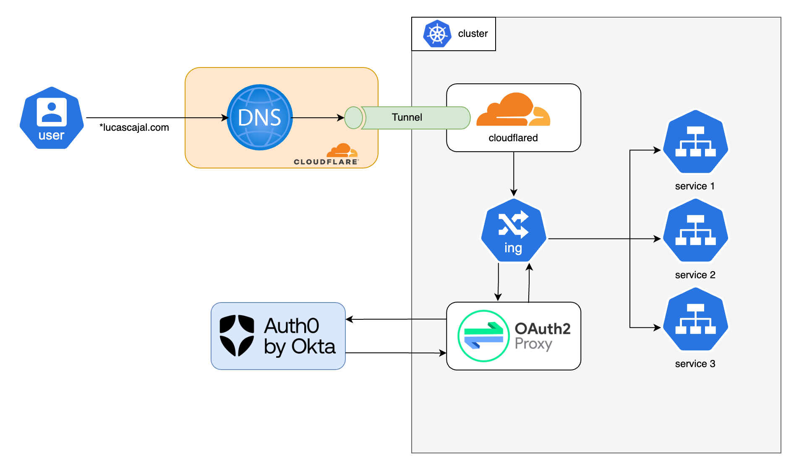

# Kubernetes homelab

Personal homelab Kubernetes cluster running on Raspberry Pi, managed with GitOps via ArgoCD. It evolved from a simple learning experiment into a self-managing cluster with full secrets management, SSO, TLS, and observability.

The setup is heavily inspired by the [ArgoCD Self-Managed Example](https://github.com/imjoseangel/k8s-gitops) repository, and its [maintainer](https://github.com/imjoseangel) has been a great k8s mentor.

## Architecture

### Stack

| Layer | Component |
|---|---|
| Kubernetes distribution | K3S (default) |
| GitOps | ArgoCD (self-managing) |
| Ingress | NGINX ingress controller + Traefik |
| TLS | cert-manager + Let's Encrypt (ACME via Cloudflare DNS challenge) |
| Secrets | Bitwarden Secrets Manager + External Secrets Operator |
| Tunnel | Cloudflared (no open ports needed) |
| Auth | Auth0 OIDC |
| Policy | Kyverno |
| Observability | Prometheus + Grafana |
| Autoscaling | VPA (Fairwinds), descheduler |
| Infrastructure (external) | Terraform — Cloudflare tunnel, DNS records, Bitwarden secrets backup |

### Network topology



## Requirements

### CLI tools

- [terraform](https://developer.hashicorp.com/terraform/install#linux)
- [kubectl](https://kubernetes.io/docs/tasks/tools/#kubectl)
- `jq`
- `make`

### External accounts and services

| Service | What it's used for |
|---|---|
| [Cloudflare](https://cloudflare.com) | Domain DNS + tunnel |
| [Bitwarden Secrets Manager](https://bitwarden.com/products/secrets-manager/) | Secrets storage (access token + project ID needed) |
| [Auth0](https://auth0.com) | OIDC provider |
| [GitLab container registry](https://docs.gitlab.com/user/packages/container_registry/) | Private app images — GitLab offers unlimited free storage for private registries |
| GitHub (PAT) | ArgoCD private repo read access |

## Usage

### Setup

Copy the Terraform vars example and fill in all values:

```bash
cp terraform/terraform.tfvars.example terraform/terraform.tfvars
# edit terraform/terraform.tfvars with your values
```

### Cluster creation

```bash
sudo make cluster
```

This runs three phases in sequence:

1. **K3S install** — installs K3S on the local machine with OIDC and other flags configured in `cluster-k3s-config.yaml`
2. **Terraform** — creates the Cloudflare tunnel, wildcard DNS records, and stores all secrets as a backup in Bitwarden; also creates the `bitwarden-access-token` secret in the cluster so External Secrets can read from Bitwarden
3. **ArgoCD bootstrap** — installs ArgoCD and applies `argocd-resources/`, which triggers ArgoCD to self-manage and sync all cluster components and applications automatically

After the cluster is ready, copy the kubeconfig:

```bash
cat ./k3s_kubeconfig.yaml > ~/.kube/config
```

> If the command fails with `The kubelet is unhealthy due to a misconfiguration of the node in some way (required cgroups disabled)`, run
>
> ```bash
> sudo nano /boot/firmware/cmdline.txt
> ```
>
> and add these options at the start of the line:
>
> ```
> cgroup_enable=memory cgroup_memory=1
> ```
>
> Then reboot with `sudo reboot`. [Read more](https://ubuntu.com/tutorials/how-to-kubernetes-cluster-on-raspberry-pi#4-installing-microk8s).

### Multi-node setup

To add an agent node to the cluster, run this on the server node to get the join command:

```bash
make print_node_join_cmd
```

Then run the printed command on the agent node.

> **Different CPU architectures**: If you add a node with a different architecture (e.g., `armv7` for an older Raspberry Pi), taint it so incompatible workloads are not scheduled there:
>
> ```bash
> kubectl taint nodes <node-name> architecture=armv7:NoSchedule
> ```
>
> Workloads that can run on that node need to add the corresponding toleration. See the Helm values under `cluster-resources/` for examples.

### Cluster deletion

```bash
make destroy
```

This destroys the K3S cluster and then runs `terraform destroy` to remove the Cloudflare tunnel and DNS records.
